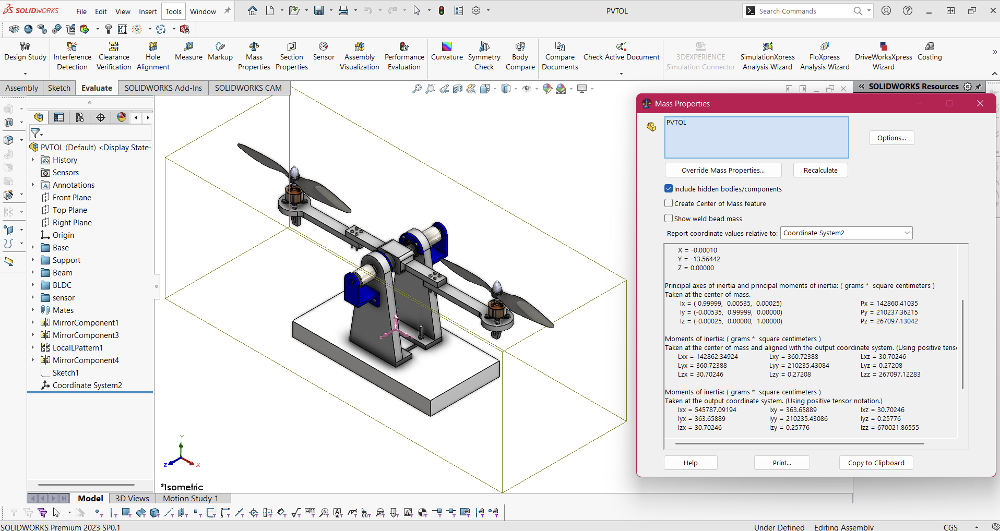
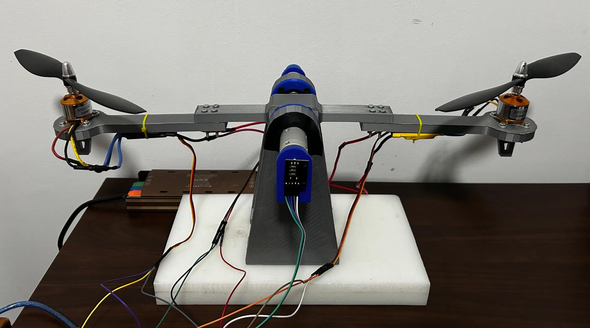
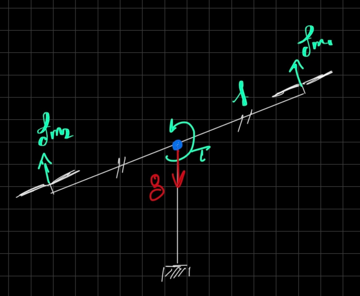
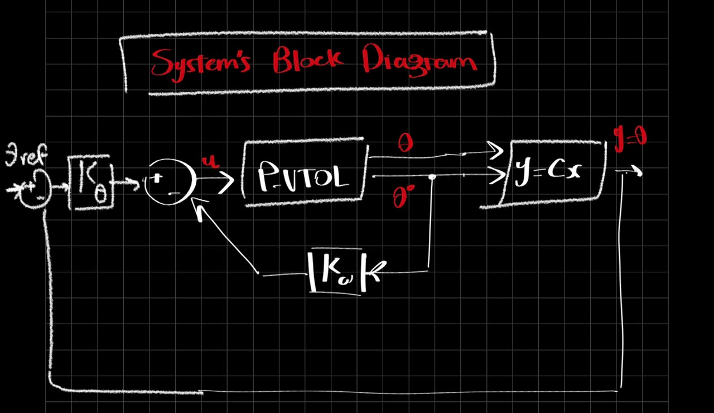
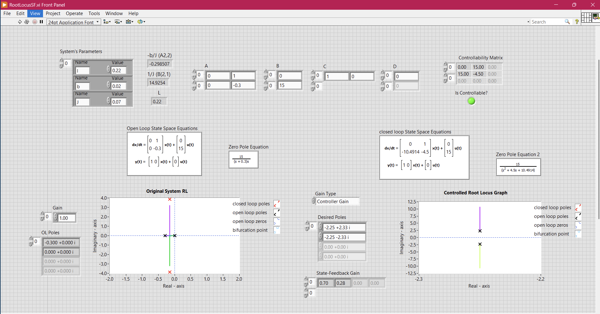
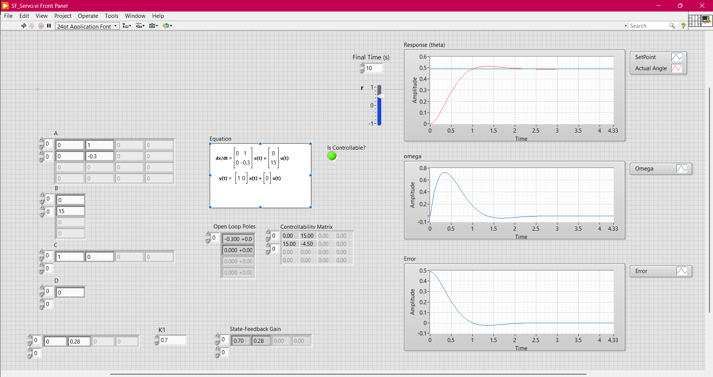
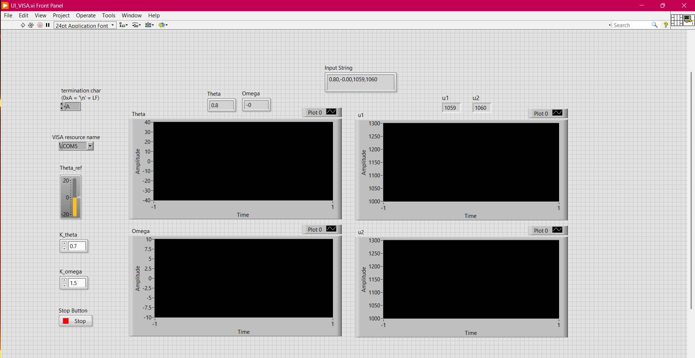

# P-VTOL Control System

A 1-DOF Planar Vertical Take-Off and Landing (P-VTOL) platform developed for studying system modeling, state-feedback control, embedded systems, and real-time communication between Arduino and LabVIEW.

The project demonstrates the complete workflow from mechanical design and fabrication to controller implementation and experimental validation on a physical system.

---

## Project Overview

The objective of this project is to stabilize and control the angular position of a rotating beam actuated by two BLDC motors.

The project is divided into the following stages:

1. Mechanical Design
2. Mathematical Modeling
3. Sensor Measurement and State Estimation
4. State-Feedback Controller Design
5. Arduino Implementation
6. LabVIEW Monitoring and Analysis
7. Real-Time Communication using NI-VISA
8. Experimental Validation

---

# Mechanical Design

The mechanical structure was designed using SolidWorks and fabricated using 3D printing.

Main components include:

* Main Beam
* Motor Holders
* Bearing Supports
* Sensor Mounts
* Bearing Retainers
* Teflon Base Plate
* 6201 Bearings
* Flexible Shaft Coupling

### CAD Model



### Final Assembly



---

# Mathematical Modeling

The system is modeled as a rigid beam rotating about a fixed pivot.

Differential thrust generated by the two BLDC motors produces the control torque acting on the beam.

The resulting equation of motion is:

```text id="9ktgx0"
Jθ̈ + bθ̇ = u
```

where:

* J : Moment of inertia
* b : Damping coefficient
* θ : Angular position
* u : Control input

The model is converted into state-space form and used for controller design and analysis.

### Free Body Diagram



---

# Measurement and State Estimation

An MPU6050 IMU is mounted near the pivot point to estimate the system states.

Measured quantities:

* Angular Position (θ)
* Angular Velocity (ω)

The accelerometer is used to estimate beam angle, while the gyroscope provides angular velocity measurements.

To improve estimation accuracy, a complementary filter is implemented to combine accelerometer and gyroscope measurements.

---

# Control System Design

A state-feedback controller is used to stabilize the system and track reference angles.

The implemented control law is:

```text id="cwsg5z"
du = -(Kθ(θ - θref) + Kωω)
```

where:

* Kθ : Position gain
* Kω : Velocity gain
* θref : Desired angle

The controller uses:

* Angle error for position correction
* Angular velocity feedback for damping

Additional implementation features include:

* PWM Saturation
* Slew-Rate Limiting
* Reference Tracking

### System Block Diagram



---

# Controller Implementation

The complete controller implementation is located inside the **Controller** directory.

```text id="c49h7k"
Controller/
├── RootLocusSF.vi
├── UI_VISA.vi
├── SF_Servo.vi
└── SF_Control/
    └── SF_Control.ino
```

---

## RootLocusSF.vi

This LabVIEW VI was developed for controller design and system analysis.

Functions:

* Enter system parameters
* Construct the state-space model
* Analyze open-loop dynamics
* Calculate state-feedback gains
* Plot root locus
* Compare system response before and after control

This VI was used to determine suitable controller gains before implementing them on the physical system.

### Dynamic Analysis VI



### Access File

[Open RootLocusSF.vi](Controller/RootLocusSF.vi)

---

### Tracking Problem Simulation VI



### Access File

[Open SF_Servo.vi](Controller/SF_Servo.vi)

---

## SF_Control.ino

This Arduino program implements the real-time controller.

Responsibilities:

* Read MPU6050 measurements
* Estimate angle and angular velocity
* Execute the state-feedback control law
* Generate ESC commands
* Apply PWM saturation and slew-rate limiting
* Send measurements and control signals to LabVIEW
* Receive controller gains and reference angle from LabVIEW

The Arduino serves as the embedded controller responsible for executing the control loop in real time.

### Access File

[Open SF_Control.ino](Controller/SF_Control/SF_Control.ino)

---

## UI_VISA.vi

This LabVIEW VI provides the user interface used during experiments.

Functions:

* Send reference angle (θref)
* Send controller gains (Kθ and Kω)
* Receive system measurements
* Receive motor commands
* Plot real-time data
* Monitor system performance
* Tune controller parameters online

This allows controller gains and setpoints to be modified during operation without reprogramming the Arduino.

### User Interface



### Access File

[Open UI_VISA.vi](Controller/UI_VISA.vi)

---

# Serial Communication Using NI-VISA

Communication between Arduino and LabVIEW is achieved through NI-VISA serial communication.

### Data Sent from LabVIEW

* Reference Angle (θref)
* Position Gain (Kθ)
* Velocity Gain (Kω)

### Data Sent from Arduino

* Angular Position (θ)
* Angular Velocity (ω)
* Motor Command u1
* Motor Command u2

This bidirectional communication enables real-time monitoring, controller tuning, and experimental validation.

---

# Experimental Results

The state-feedback controller successfully stabilizes the beam and tracks reference angles in real time.

During operation:

1. LabVIEW sends controller gains and desired setpoints.
2. Arduino executes the control algorithm.
3. Sensor measurements are acquired and processed.
4. Control commands are sent to the motors.
5. System states and actuator commands are streamed back to LabVIEW for visualization and analysis.

The complete experimental demonstration is available below.

### Demonstration Video

[Watch Project Demonstration](Videos/testExp.mp4)

---

# Repository Structure

```text id="t9nqmg"
├── Controller/
│   ├── RootLocusSF.vi
│   ├── UI_VISA.vi
│   └── SF_Control/
│       └── SF_Control.ino
│
├── images/
│
├── Videos/
│
├── CAD/
│
├── STL/
│
├── Docs/
│
└── README.md
```

---

# Future Improvements

Possible extensions of this project include:

* LQR Control
* LQG Control
* Kalman Filtering
* Fuzzy Logic Control
* Model Predictive Control (MPC)
* Vision-Based Feedback
* Adaptive Control

---

# Author

**Ali Gamal Ali**

LinkedIn:
https://www.linkedin.com/in/ali-gamal

GitHub:
https://github.com/AliOmran88
