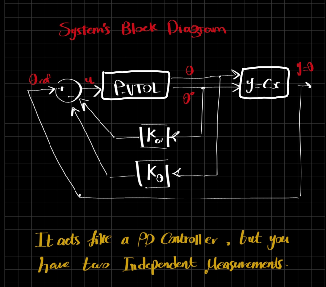

# P-VTOL Control System

A 1-DOF Planar Vertical Take-Off and Landing (P-VTOL) platform developed for studying system modeling, state-feedback control, embedded systems, and real-time communication between Arduino and LabVIEW.

The project covers the complete workflow from mechanical design and fabrication to controller implementation and experimental validation.

---

## Project Overview

The objective of this project is to stabilize and control the angular position of a rotating beam actuated by two BLDC motors.

The project is divided into the following stages:

1. Mechanical Design
2. Mathematical Modeling
3. Sensor Measurement and State Estimation
4. State-Feedback Controller Design
5. Arduino Implementation
6. LabVIEW Monitoring and Control
7. Experimental Validation

---

## Mechanical Design

The mechanical structure was designed using SolidWorks and fabricated using 3D printing.

Main components:

* Main Beam
* Motor Holders
* Bearing Supports
* Sensor Mounts
* Bearing Retainers
* Teflon Base Plate
* 6201 Bearings
* Flexible Shaft Coupling

### CAD Model


### Final Assembly


---

## Mathematical Modeling

The system is modeled as a rigid beam rotating about a fixed pivot.

The control torque is generated using differential thrust from the two motors.

The resulting dynamic equation is:

Jθ̈ + bθ̇ = u

where:

* J : Moment of inertia
* b : Damping coefficient
* θ : Beam angle
* u : Control input

The system is then converted into state-space form for controller design.

### Free Body Diagram


---

## Measurement and State Estimation

An MPU6050 sensor is mounted near the pivot point to measure:

* Angular Position
* Angular Velocity

### Angle Measurement

The accelerometer is used to estimate pitch angle.

### Angular Velocity

The gyroscope is used to obtain angular velocity.

### Sensor Fusion

A complementary filter combines accelerometer and gyroscope measurements to obtain a more accurate estimate of beam angle.

---

## Controller Design

A state-feedback controller is implemented using:

u = -Kθ(θ - θref) - Kωω

The controller uses:

* Angle Error for position correction
* Angular Velocity for damping

The control effort is translated into differential motor commands.

Additional features include:

* PWM Saturation
* Slew-Rate Limiting
* Reference Tracking

### System Block Diagram



---

## Hardware Implementation

### Electronics

* Arduino Uno
* MPU6050 IMU
* 2 × ESC
* 2 × BLDC Motor
* Power Supply

### Arduino Responsibilities

* Read sensor measurements
* Estimate system states
* Execute control algorithm
* Generate ESC commands
* Exchange data with LabVIEW

---

## LabVIEW Interface

LabVIEW is used for:

* Reference Angle Input
* Controller Gain Tuning
* Real-Time Monitoring
* Data Logging

### Dynamic Analysis VI


### User Interface


---

## Serial Communication Using VISA

Communication between Arduino and LabVIEW is achieved using NI-VISA over a serial connection.

### Data Sent from LabVIEW

* Reference Angle
* Kθ
* Kω

### Data Returned from Arduino

* Motor 1 Command
* Motor 2 Command
* Angle
* Angular Velocity

This communication loop enables real-time monitoring and controller tuning.

---

## Experimental Results

The controller successfully stabilizes the beam and tracks reference angles in real time.

The complete closed-loop operation can be observed in the demonstration video below.

### Demonstration Video

[Watch Project Demonstration](Videos/testExp.mp4)

---

## Repository Structure

```text
├── Arduino/
├── LabVIEW/
├── MATLAB/
├── images/
├── videos/
├── docs/
└── README.md
```

---

## Future Improvements

Possible extensions include:

* LQR Control
* LQG Control
* Kalman Filtering
* Fuzzy Logic Control
* Model Predictive Control (MPC)
* Vision-Based Feedback

---

## Author

Ali Gamal Ali

LinkedIn:
[www.linkedin.com/in/ali-gamal](http://www.linkedin.com/in/ali-gamal)

GitHub:
https://github.com/AliOmran88
